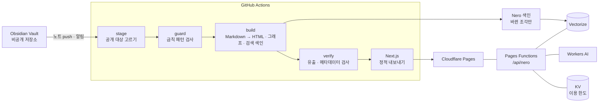

# hskim.me

옵시디언에 쌓아 온 공부 · 프로젝트 · 일상 기록을, 공개해도 되는 것만 골라 자동으로 웹사이트로 만드는 개인 지식 베이스입니다.

**사이트** — https://hskim.me

노트를 고쳐 Vault 저장소에 올리면 사이트가 스스로 다시 만들어지고, 그 과정에서 공개 범위 · 유출 · 품질 검사를 통과하지 못하면 배포가 멈춥니다.

## 무엇을 볼 수 있나

| 화면 | 내용 |
|---|---|
| 메인 (`/`) | 노트 600여 편과 그 사이 링크를 별자리처럼 그린 3D 지식 그래프. 별을 누르면 그 문서로 간다 |
| 지식 노트 (`/notes`) | 분야별 개념 노트. 옵시디언 문법(위키 링크 · 임베드 · 콜아웃), 수식(KaTeX), 도표(Mermaid)를 그대로 보여 준다 |
| 프로젝트 (`/projects`) | 개인 · 팀 · 실무 프로젝트 기록 |
| 포트폴리오 (`/portfolio`) | 대표 프로젝트 모음 |
| 소개 (`/about`) | 노트 · 프로젝트 · 자격 기록에서 자동으로 계산하는 게임 스탯창과 칭호 |
| 일상 (`/life`) | 사진과 짧은 기록 |
| 전체 목록 · 검색 | 모든 공개 문서의 목차와 한글 검색 |
| **Nero** | 공개된 노트만 근거로 답하고 근거 링크를 붙이는 사이트 AI 도우미 |

## 구조



- **pipeline/** — Vault 를 읽어 공개 대상만 스테이지로 옮기고(stage), 검사하고(guard), 사이트 데이터를 만든다(build).
  Markdown 은 unified(remark · rehype)로, 옵시디언 고유 문법은 Quartz 플러그인으로 바꾼다.
- **web/** — Next.js 정적 사이트. 3D 그래프는 react-force-graph-3d(three.js), Nero 서버는 Pages Functions.
- **infra/** — Cloudflare · DNS · Vault 저장소 설정 절차.

## 공개 안전장치

기록을 통째로 공개하는 사이트라, **무엇을 내보내지 않을지**를 먼저 설계했습니다.

1. **허용한 폴더만** 읽는다. 그 밖의 폴더는 처음부터 보지 않는다.
2. 문서마다 `publish: false` 로 뺄 수 있고, 회사 프로젝트 기록은 반대로 **공개를 승인한 것만** 나간다(옵트인).
3. **콘텐츠 가드** — 비밀값 · 연락처 · 내부망 주소 모양 같은 패턴이 공개 대상에 있으면 빌드를 실패시킨다.
   회사 프로젝트 전용 규칙은 규칙 문장 자체가 민감할 수 있어 공개 저장소가 아닌 비공개 Vault 에 둔다.
4. **유출 검사** — 다 만든 결과물에 비공개 문서의 제목이나 그 문서로 가는 링크가 남았는지 한 번 더 본다.
5. 검사 하나라도 실패하면 **배포하지 않는다.**

## Nero — 사이트 AI 도우미

공개 산출물을 문단 단위로 나눠 임베딩(`bge-m3`)하고 Vectorize 에 색인합니다. 질문이 오면 관련 문단을 찾아 답변 모델(Workers AI 의 Gemma)에 근거로 넘깁니다.

- 배포마다 **내용이 바뀐 조각만** 다시 색인한다. 색인이 실패해도 사이트 배포는 계속되고, Nero 는 이전 색인으로 답한다.
- 요청마다 사람 확인(Turnstile), 분 · 일 단위 이용 한도를 거친다.
- 답은 **전체를 검사한 뒤** 보낸다 — 설정 문장 유출, 지어낸 링크, 공개 주소 외 연락처를 걸러 내고, 실제로 찾은 문서의 링크만 붙인다.
- 질문과 답 본문은 저장하지 않는다. 이용 한도를 세는 값은 날짜를 섞은 해시로 48시간만 남는다.
- 공격 질문 모음(`npm --prefix web run qa:nero`)으로 설정 유출 · 역할 탈취 시도를 시험한다.

## 품질 검사

CI 는 배포 때마다 유출 · 메타데이터 검사와 라우트 검사를 돌리고, 화면 시험은 UI 를 바꿀 때 돌립니다.

| 검사 | 명령 |
|---|---|
| 유출 · 메타데이터 | `npm --prefix pipeline run verify` |
| 라우트 · 사이트맵 주소와 canonical 일치 | `web` 빌드 뒤 자동 (`postbuild`) |
| 세 브라우저(Chromium · Firefox · WebKit) 화면 · 접근성 시험 | `npm --prefix web run qa` |
| HTML 표준(W3C 검사기) | `npm --prefix web run qa:html` |

웹 접근성은 KWCAG 2.2 기준으로 자체 점검했고, CSP · HSTS 같은 보안 응답 헤더를 둡니다.

## 로컬에서 실행

Node.js 20 이상이 필요합니다. 콘텐츠 원본인 Vault 가 있어야 빌드됩니다.

```bash
npm run setup                      # pipeline · web 의존성 설치
export VAULT_PATH=/path/to/vault   # 기본값은 작성자의 로컬 경로
npm run content                    # Vault → 사이트 데이터 (stage · guard · build · verify)
npm run dev                        # 개발 서버
npm run build                      # 콘텐츠 + 정적 사이트 빌드
```

## 기술

Next.js 15 · React 19 · TypeScript · three.js(react-force-graph-3d) · unified(remark · rehype) · KaTeX · Mermaid ·
Cloudflare Pages · Pages Functions · Workers AI · Vectorize · KV · Turnstile · GitHub Actions · Playwright
