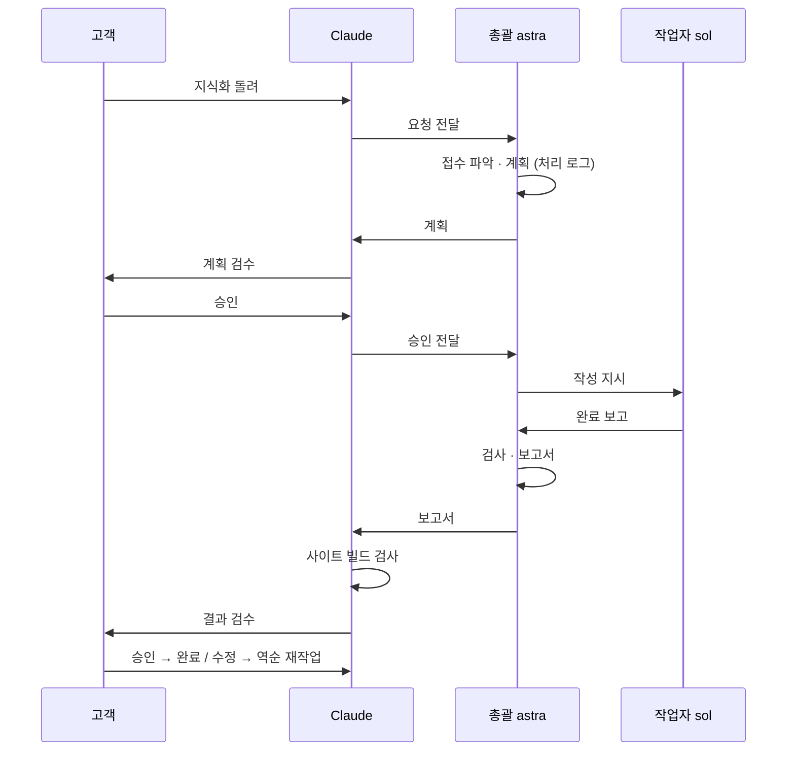

# 지식화 자동화

| | |
|---|---|
| 문서 상태 | 확정 (2026-09-29 고객 결정) |
| 실행 규칙 원문 | Vault `04 Operations/지식화 자동 실행 규칙.md` — 규칙은 Vault 한 곳에만 둔다. 이 문서는 설계 배경과 Claude 쪽 실행 방법 |
| 관련 | Vault `AGENTS.md`, `Extraction Workflow.md`(사이트 공개 요건), `Project 케이스 지식화 규칙.md`, `포트폴리오 작성 규칙.md` |

## 1. 목표

고객이 **"지식화 돌려"** 한마디만 하면, `00 Inbox/Raw Import/` 의 자료를 규칙대로 지식화하고 사이트 배포가 멈추지 않는 상태까지 검사해 보고한다. 고객은 계획과 결과, 두 번만 검수한다.

## 2. 두 갈래

| 갈래 | 입력 | 산출물 |
|---|---|---|
| A. 지식 | `Raw Import/` 중 `Project/` 를 뺀 전부 | `01 Knowledge DB/` 신규 · 보강 · 통합, MOC 연결 |
| B. 프로젝트 | `Raw Import/Project/` 또는 코드 폴더 | `02 Project Cases/` → `Portfolio.md` 목차 · 섹션 · 진행 현황 |

A 는 어떤 형태의 자료든 기존 DB 전체를 하나의 큰 지식 덩어리로 보고 개념 단위로 재구조화한다.
B 의 결과 중 경험치 · 스킬 · 칭호 진행도는 사이트가 자동으로 계산한다. `Profile.md`(대표 퀘스트 · 특성 · 기록)는 고객이 정하고, 에이전트는 후보만 제안한다.

## 3. 역할과 흐름

| 역할 | 모델 · 강도 | 하는 일 |
|---|---|---|
| Claude | — | 고객 창구. 요청을 총괄에게 전하고, 계획 · 보고서를 고객에게 보이고, 사이트 빌드 검사를 한 번 더 돌린다 |
| 총괄 | `gpt-6-astra` · high | 접수 파악(A · B 분류), 계획, 작업자 지시, 검사, 보고서 |
| 작업자 | `gpt-6-sol` · high | 승인된 계획대로 작성. 총괄이 하위 에이전트로 띄운다 |



고객이 Codex 에게 직접 "지식화 돌려"라고 해도 같은 절차로 돈다. 총괄이 Vault `AGENTS.md` → 실행 규칙을 스스로 읽는다. 이때는 Claude 칸이 빠지고, 사이트 검사는 총괄이 한다.

**수정 요청 시 역순**: 계획을 고칠 일이면 총괄이 계획부터 고쳐 다시 승인받는다. 작성만 고칠 일이면 작업자 → 검사 → 보고를 다시 한다.

## 4. Claude 쪽 실행 방법

```bash
V="/mnt/c/Users/user/Documents/Obsidian Vault"

# 계획 — 세션 id 를 받아 둔다 (승인 뒤 같은 대화를 잇기 위해)
codex exec -C "$V" -m gpt-6-astra -c model_reasoning_effort=high -s workspace-write \
  --add-dir ~/project/hskim-me/pipeline "지식화 돌려"

# 승인 · 수정 요청 — 같은 세션을 잇는다
codex exec resume <세션 id> "승인. 작성 단계 진행"
```

- `--add-dir pipeline` 은 총괄의 사이트 검사(`npm run build`)가 `pipeline/out` 에 쓰기 위해서다. Vault 는 읽기만 한다
- 긴 작업은 백그라운드로 돌리고, 끝나면 보고서를 고객에게 보인다

**2026-09-29 확인**: astra 가 `spawn_agent` 로 sol 을 띄우고, 모델과 추론 강도를 지정할 수 있다 (시험 응답 `SOL_OK gpt-6-sol`, Codex 0.158.0 — 0.153 에서는 gpt-6-sol 이 목록에 없었다).

## 5. 정한 것

| 항목 | 결정 |
|---|---|
| 계획 승인 | 매번 고객이 승인 |
| 결과 승인 | 매번 고객이 승인. 수정은 역순 재작업 |
| 자동 백업(obsidian-git)과 겹침 | 당장은 신경 쓰지 않는다. 중간 상태가 올라가도 공개 사고는 가드가 막고, 배포가 멈추면 검사 뒤 다시 돈다 |
| 시작 | 고객이 "지식화 돌려"라고 할 때만. Claude · Codex 어느 쪽에 말해도 된다 |
| 첫 대상 | `Personal Study/hskim.me/` 개념 노트 27개 (A). 사이트 작업 이야기는 빼고, 원본은 나중의 hskim.me 프로젝트 케이스 재료로 남긴다 |
